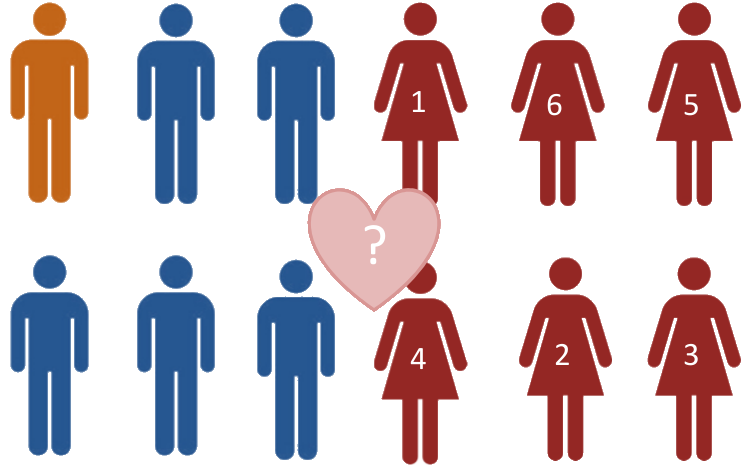
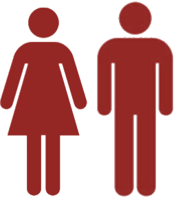

```{r setup, include=FALSE}
options(htmltools.dir.version = FALSE)
```

# Scenario


---

# What is a stable marriage situation?

-  A matching of men and women such that no two people of opposite sex would **both** rather have each other than their current partners.



---
#Gale – Shapley algorithm (1962)


Oberwolfach
Photo Collection

- Male proposes to his preferred female

--

- If available she always accepts his proposal, and we consider the next male.

--

- If already engaged she chooses her favourite. The rejected male must now propose to his next preference.

---


# Proof that G-S algorithm gives a stable pairing.

--

- Suppose Bob prefers Alice to his wife Bobetta

--

- During G-S, Bob must have proposed to Alice before proposing to Bobetta.

--

- If Alice accepted his proposal, yet is not married to him at the end, she must have dumped him for someone she likes more, and therefore doesn't like Bob more than Alan.

--

- If Alice rejected his proposal, she was already with someone she liked more than Bob.

---

# Other applications

- Stable roommates problem
- Medical interns and hospitals

---
class: center, middle

# Always make the first move
