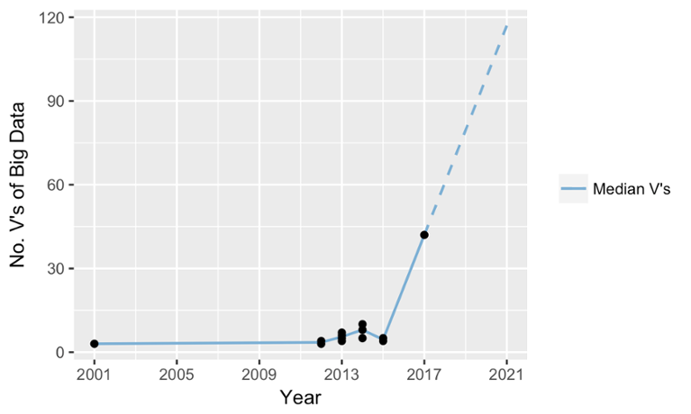
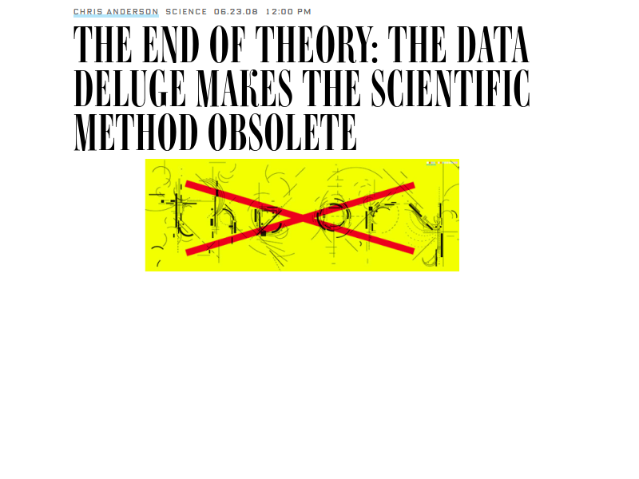
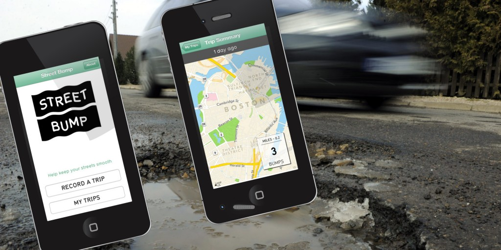

```{r setup, include=FALSE}
options(htmltools.dir.version = FALSE)
```

# What is Big Data?


* Volume
* Velocity
* Variety
--

* Veracity
--

* Value
--



---
class: center, middle



---
class: center, middle


---

# If we have *all* the data - statistical sampling is redundant!

--
* We never have *all* the data.
* Beware of hidden biases in messy data.

--




---
# Who cares about what causes what! Statistical correlation tells us what we need to know.

--


---
# Statistical models are obsolete - with enough data, the numbers speak for themselves

--


---
class: center, inverse

## Final Thoughts

--
ers little by itself.

--

There are a lot of small data problems that occur in big data, and they don’t disappear because you’ve got lots of the stuff. They get worse.

--

New developments such as Hadoop and Apache Spark allow storage and fast processing of big data.

--

With carefully built models, well thought-out statistical assumptions, awareness of bias and domain-specific knowledge, big data can be a very powerful tool.


