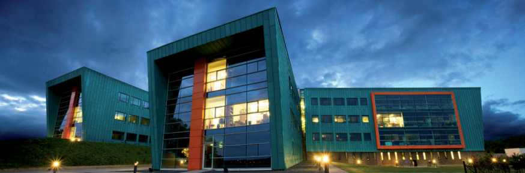
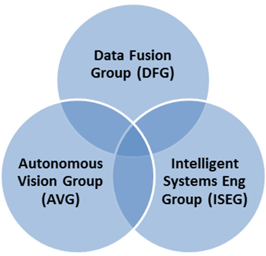
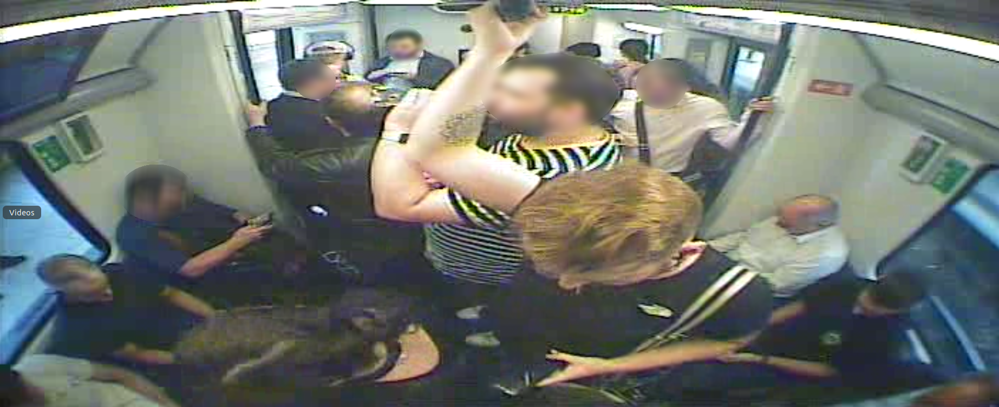
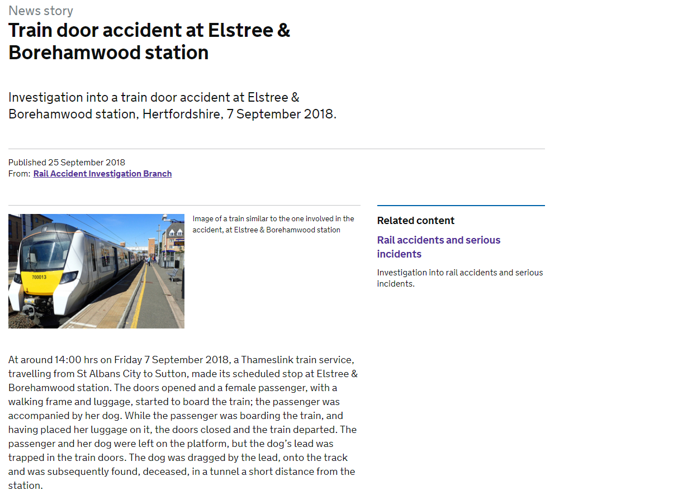
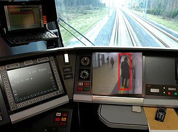
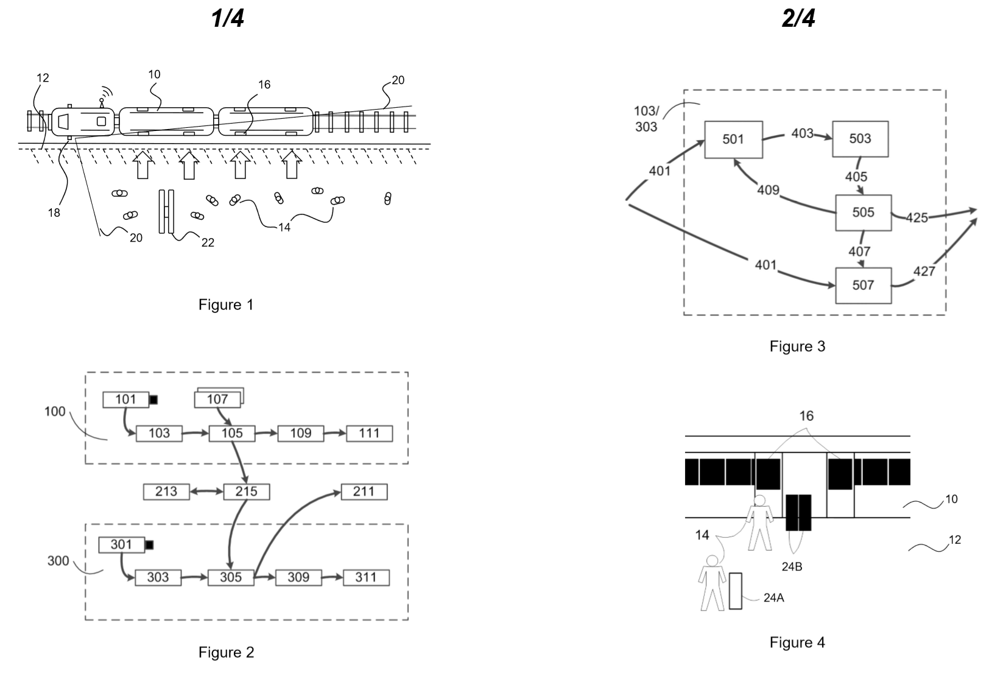
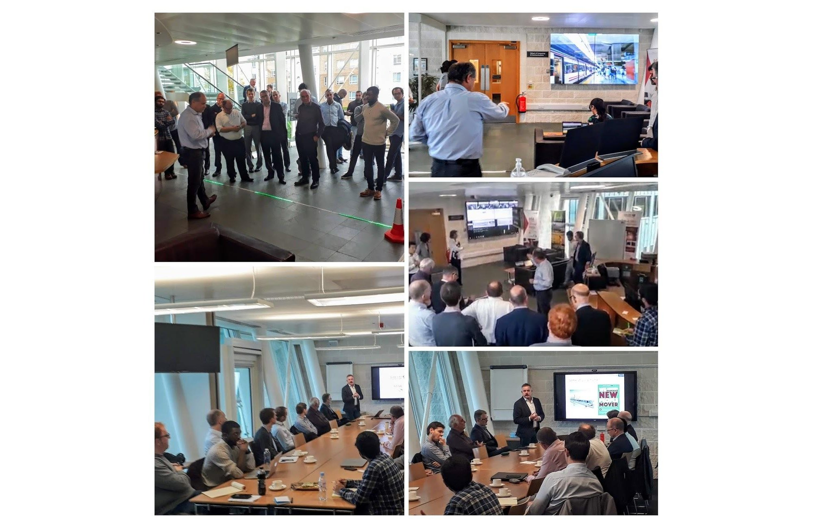

class: center, middle
```{r setup, include=FALSE}
options(htmltools.dir.version = FALSE)
```

<!-- Who we are - what we do -->




---
class: center, middle



---
<!-- Faster, safer, better - Can we use computer vision? -->

---
class: center, middle
<!-- Faster - reduce dwell time-->

---

class: center, middle


---
class: center, middle


---
class: middle, center
# Faster
# Safer 
# Better

<!-- 
* Use CV to make boarding faster, safer, better
* Reduce dwell time
* Alert staff to dangerous situations
* Need to be *real-time*
* Use existing infrastructure Old stock --->

---
class: center, middle


<!-- In both cases, we need to identify the people and where they are in the image. Once we know this we can then do the ga or busyness calcuations.

First step is background subtraction 

Train the algorithm to estimate what the background looks like
Assume that everything else is foreground
Simple, naive, but works well. 
Edge flow - improves the estimates.

Yellow line  detection


-->

---

class: center, middle


---
class: center, middle

---
class: center, middle


---
class: center, middle

<!-- Shows the safety. Alerts staff if someone is on or over the line for a prolonged period of time-->


[Youtube](https://www.youtube.com/watch?v=NKW54OzxoHI&feature=youtu.be)

---

class: center, middle

<!-- Shows the safety. Alerts staff if someone is on or over the line for a prolonged period of time-->


---

<!--* Spots dangerous scenarios quickly and automomously
* Alert staff to inform decision making
* Estimate busyness of each carraiage
* Works on platforms too
* Uses Existing infra-structure
* Real-time
* Computationally efficient
* Patent application-->



---
class: middle, center



<!-- What's next?s

* Test, test, test
* Pilot programme on a real track
* Human factors -->


---
class: center, middle

# Thanks


@digitalrailltd / @trianglegirl

rhian.davies@digitalrail.co.uk


