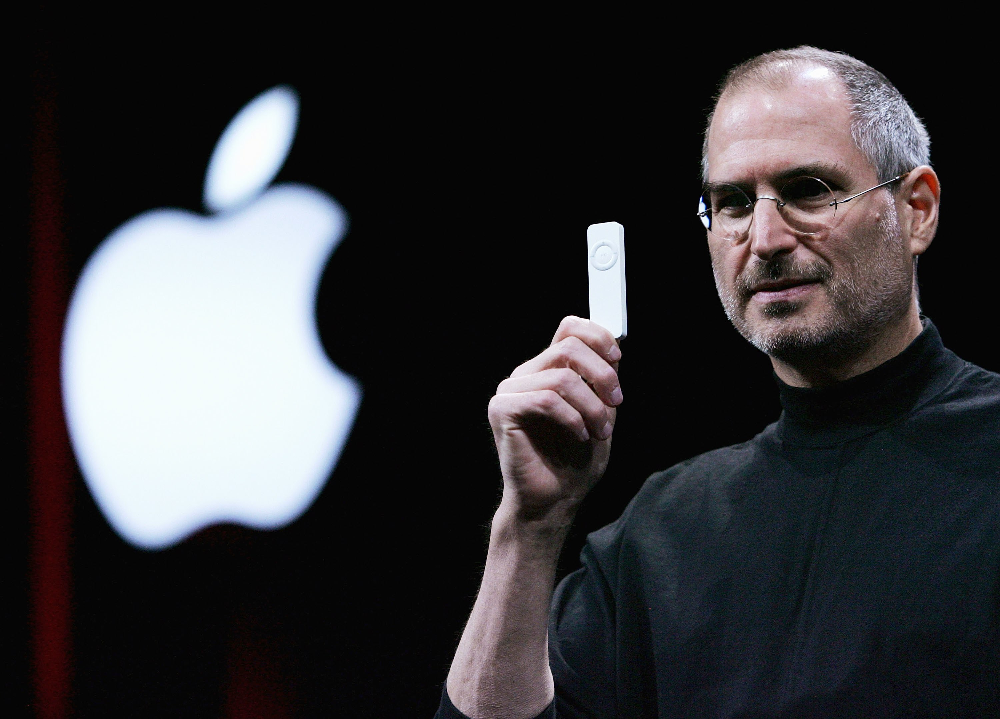
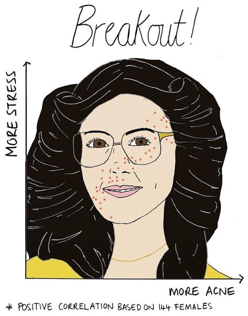

```{r setup, include=FALSE}
options(htmltools.dir.version = FALSE) 
rpurple <- "#88398A"
library(tidyverse)
```

<!--Abstract:
Humans are bad at dealing with randomness and probabilities - we ignore the obvious and see patterns in the ordinary. It's my job to decide whether differences in the data are due to chance or a real underlying cause. Stories of real projects (personality and deodorant) and discuss the pitfalls that we humans often stuggle with
    #chakra: libs\remark-latest.min.js
-->

# Secretly choose a number between 1 and 6...

<!-- Everyone, choose a number between 1 and 6. Just choose the first number you thing of. Stick with it. Ok, hands up if you chose the number 3...? How about 6?-->

--

```{r bar graph 100, echo = FALSE, fig.width = 12, fig.height = 6.5}
set.seed(150) #150
Dice <- sample(1:6, 100, replace  = TRUE)
Humans <- rep(1:6, c(7,14,35,13,19,12))

bar_plot_100 <- 
as.tibble(cbind(Humans, Dice)) %>%
gather(key = type, value = number) %>%
  mutate(number = as.factor(number)) %>%
ggplot(aes(x = number)) + 
geom_bar(fill = rpurple) + 
  facet_grid(~type) + 
  xlab("Number") +
  ylab("Count") +
 theme_minimal(base_size = 25) +
  theme(panel.grid.major = element_blank(), panel.grid.minor = element_blank()) 
  
bar_plot_100
```
---

# Secretly choose a number between 1 and 6...

```{r bar graph 1000, echo = FALSE, fig.width = 12, fig.height = 6.5}
set.seed(150) #150

Dice <- sample(1:6, 1000, replace  = TRUE)
Humans <- rep(1:6, c(70,135,300,140,215,140))

bar_plot_1000 <- 
as.tibble(cbind(Humans, Dice)) %>%
gather(key = type, value = number) %>%
  mutate(number = as.factor(number)) %>%
ggplot(aes(x = number)) + 
geom_bar(fill = rpurple) + 
  facet_grid(~type) + 
  xlab("Number") +
  ylab("Count") + 
 theme_minimal(base_size = 25) +
  theme(panel.grid.major = element_blank(), panel.grid.minor = element_blank()) 
bar_plot_1000
```

---
<!--You’re listening to music on shuffle, and an artist appears twice in a row. It feels like more than a coincidence – perhaps your music player is playing tricks on you, or has chosen favoured artists – but is it?

In fact, music players tend not to shuffle randomly. But that’s because if it did, it would actually feel less random.

Human brains will start seeing patterns in even the smallest coincidences – and in a long shuffled playlist, it’s likely that certain songs or artists will come next to one another.

“The problem is that to humans, truly random does not feel random,” Mattias Petter Johansson, a Spotify developer, wrote in an internet post earlier this month. “So we got tons of complaints from users about it not being random.

“Last year, we updated it with a new algorithm, that is intended to feel more random to a human.”

The feeling that playlists are being played with comes partly from the Gambler’s Fallacy – a trick of the brain that leads us to think that if something hasn’t happened for a long time, it is more likely to happen again. If a coin lands on heads three times, for instance, it instinctively feels like it should  – but there is an equal chance of it landing on heads again.

That means that if a playlist repeats artists, songs or genres then it feels wrong. If shuffle is truly random, the Gambler’s Fallacy leads us to think, then the songs should be more spaced out. But there is an equal chance that songs will come close together as there is that they will be far apart

-->



---
# Statistician

* My job to decide whether differences in the data are due to chance or a real underlying cause.
* Skeptical
* Tools to work out which numbers are real.

---

# Teenage pregnancy

Over 40,000 teenage pregancies in the UK each year (check)
Orkney had one of the highest teenage pregnancy rates in Scotland
Health workers tried something new -> talking
the teenage pregnancy rates halfed! Amazing
--
<center>

</center>

<!--Let's look more closely.-->

---
class: center, middle
<center>

</center>

---

class: center, middle
<center>

</center>

---
# What happens if we just depend on averages?

--

---

# Predicting Personality?


---
class: center, inverse, middle


@ FryRsquared @MonaChalabi
---
class: center, inverse, middle

---
class: center, inverse, middle

---
class: center, middle, inverse
# @trianglegirl

