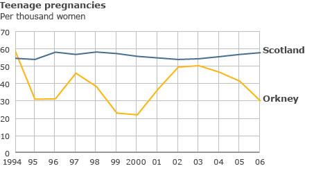
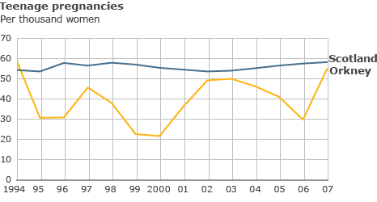

```{r setup, include=FALSE}
knitr::opts_chunk$set(echo = TRUE)
```
 ## Unused notes
 
 
# Teenage pregnancy

Over 40,000 teenage pregancies in the UK each year (check)
Orkney had one of the highest teenage pregnancy rates in Scotland
Health workers tried something new -> talking
the teenage pregnancy rates halfed! Amazing
--
<center>

</center>
<!--Let's look more closely.-->

---
class: center, middle
<center>

</center>

---

class: center, middle
<center>

</center>


# Can't we just use averages?

--
