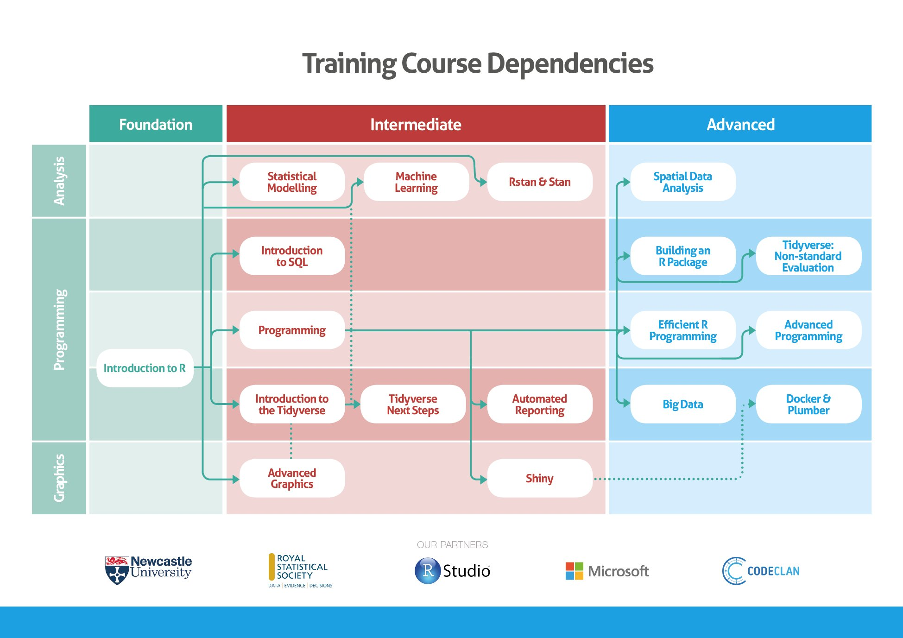

```{r setup, include=FALSE, message=FALSE}
library("emo")
library("icon")
library("jrPresentation")
library("knitr")
options(htmltools.dir.version = FALSE)
set_presentation_options()
knitr::opts_chunk$set(cache = FALSE)
```

layout: true
`r add_border(inverse=TRUE)`

---
class: center, middle

```{r, fig.width = 12, echo = FALSE}
# Bigger fig.width

```
---
class: center, middle, inverse

# What is R?

---
layout: true
`r add_border(inverse=FALSE)`

---

# R is

* open source and free

* the lingua franca of statistics

* is a programming language you can add your own functions

* used by Google, BBC, IBM, Shell, and Facebook
  
* is excellent for graphics and statistics

* cross platform

--

* great for procrastination


---
background-image: url("https://media.giphy.com/media/eSakWipdNIaas/giphy.gif")
background-position: 50% 50%
class: center, inverse
---
class: middle
```{r coffeetime, eval = FALSE}
library("beepr")
Sys.sleep(180)
beep()
```
---
background-image: url("https://media.giphy.com/media/pMDNVVNOKp3Ta/giphy.gif")
background-position: 50% 50%
class: center, inverse
---
class: middle
```{r coffeetime rap, eval = FALSE}
library("BRRR")
Sys.sleep(180)
skrrrahh(18)
```
---
background-image: url("images/compiling.png")
background-position: 50% 50%
background-size: 70%
class: center, inverse
---
class: middle

```{r comics, eval = FALSE}
library("RXKCD")
getXKCD(which = "current")
```
---
# Twitter
```{r authenticate, echo = FALSE, message = FALSE, warning = FALSE, results = "hide"}
library("rtweet")
library("tidyverse")
library("knitr")
create_token(
  app = "rhian",
  consumer_key = Sys.getenv("twitterKey"),
  consumer_secret = Sys.getenv("twitterKeySecret"),
  access_token = Sys.getenv("twitterToken"),
  access_secret = Sys.getenv("twitterTokenSecret"))
```

```{r rladies tweets, messages = FALSE, warnings = FALSE}
library("rtweet")
tweets <- as_tibble(search_tweets(q = "#GameOfThrones"))
```

.center[]
---
# Twitter

```{r view tweets, echo = FALSE}
font.size = "10pt"
tweets %>%
  select(screen_name, text, retweet_count) %>%
DT::datatable(options=list(
       initComplete = htmlwidgets::JS(
          "function(settings, json) {",
          paste0("$(this.api().table().container()).css({'font-size': '", font.size, "'});"),
          "}")
       ) ) %>%
  DT::formatStyle(columns = c("screen_name", "text", "retweet_count"), fontSize = '8px')
```
---
background-image: url("https://media.giphy.com/media/o0vwzuFwCGAFO/giphy.gif")
background-position: 50% 50%
background-size: 50%
class: center, inverse
---
# Actually doing some work now...

## Reports `r emo::ji("memo")`

## Packages `r emo::ji("package")`

## Shiny apps `r emo::ji("sparkles")`

## Handouts `r emo::ji("notebook")`

---
# Python  `r emo::ji("snake")`

```{r python, echo = TRUE,message=TRUE}
library("reticulate")
source_python("python-script.py")
python_hello()
```

---

# SPSS `r emo::ji("chart_decreasing")`

```{r haven, echo = TRUE, message=TRUE, eval = FALSE }
library("haven")
read_sav("nasty-spss-data-file-ugh.sav")
```

---

# PASTA `r emo::ji("spaghetti")`
```{r datapasta, echo = TRUE,message=TRUE, eval = FALSE }
library("datapasta")
```

---

background-image: url("images/tribble_paste.gif")
background-position: 50% 50%
background-size: 100%
class: center, inverse

---

background-image: url("https://media.giphy.com/media/4dSecMvy8Sdz2/giphy.gif")
background-position: 50% 50%
background-size: 100%
class: center, inverse

---

# Strava  `r emo::ji("runner")`
```{r setup strava, echo = FALSE, message=FALSE, warning=FALSE, results = "hide"}
# Strava
library("lubridate")
act_data = readr::read_csv("strava-data.csv")
app_secret = "95fe5dd67d9b862000289f580d4724b6e84d97a0"
app_name = "Statistical Sports Analysis"
app_client_id = "17060"
```

```{r get data, eval = FALSE}
library("rStrava")
strava_token <- httr::config(token = strava_oauth(app_name, app_client_id, app_secret))
my_acts <- get_activity_list(strava_token)
act_data <- compile_activities(my_acts) 
```

```{r strava data, warning = FALSE, message=FALSE}
total_dist =
act_data %>%
  filter(start_date_local > ymd("2019-01-01")) %>%
  mutate(week = week(start_date_local)) %>%
  filter(type == "Run" | type == "Ride") %>%
  group_by(week, type) %>%
  summarise(total_dist = sum(distance))
```

---

# Strava  `r emo::ji("runner")`

```{r strava plot, fig.width = 8, fig.height = 2}
total_dist  %>%
 ggplot(aes(x = week, y = total_dist, fill = type)) + 
  geom_col() +
  xlab("Week of 2020") + 
  ylab("Distance (km)") +
  facet_grid(cols = vars(type))
```

---

# Leaflet

```{r map runs, echo = FALSE, message = FALSE, warning = FALSE, fig.width=10}
library("googlePolylines")
library("leaflet")
library("sp")
library("data.table")

poly = googlePolylines::decode(act_data$map.summary_polyline)
dt = rbindlist(poly, idcol = "id")  
dt = dt[!which(is.na(dt$lat)),]
dt = dt[!which(is.na(dt$lon)),]
lst_lines <- lapply(unique(dt$id), function(x){
    Lines(Line(dt[id == x, .(lon, lat)]), ID = x)
  })
  
  ## spatial lines object
  spl_lst <- SpatialLines(lst_lines)
  
  ## can now plot the spatial lines
  leaflet(spl_lst) %>%
    addProviderTiles("CartoDB.PositronNoLabels") %>%
    addPolylines(opacity = 0.4, weight = 3, color = "#562457") %>%
    setView( -2.786961, 54.010532, zoom = 12)
```

---

# Writing slides


---
# Writing slides

```{md}
library("xaringan")

---
title: "A day in the life with R"
subtitle: ""
author: "Rhian Davies ([\\@trianglegirl](https://twitter.com/trianglegirl))"
---

# About me
  


* I love R
* I play the triangle
* I love pasta
```
---
# Write a blog post

```{markdown blogpost, eval = FALSE}
library("blogdown")
blogdown::new_post(title = "Making a blog post in R")

---
title: Making a website in R
author: ''
date: '2020-05-28'
slug: making-a-website-in-r
categories: []
tags: []
---
# You'll never believe this one cool trick about R

Witty, interesting content.


```

## [trianglegirl.rbind.io/](http://trianglegirl.rbind.io/post/tidy-tuesday/)

---
# Write a C.V

```{r cv, eval = FALSE}
library("pagedown")
```


---
background-image: url("https://media.giphy.com/media/eSQKNSmg07dHq/giphy.gif")
background-position: 50% 50%
background-size: 100%
class: center, inverse

---
# Bookdown `r emo::ji("book")`

```{c pasta, eval =FALSE}
# Pasta

## Lentil Ragu

* 1 onion, finely chopped
* 2 carrots, finely chopped
* celery finely chopped
* 2 garlic cloves, crushed
* 250g bag dried red lentils
* 400g cans chopped tomatoes
* 1 tbsp tomato purée
* 1 tsp each dried oregano and thyme
* 1 bay leaf
* 500ml vegetable stock
* 250g spaghetti

Heat the oil in a large saucepan and add the onions, carrots, celery and garlic. Cook gently for 15-20 mins until everything is softened.
Stir in the lentils, chopped tomatoes, tomato purée, herbs and stock. Bring to a simmer, then cook for 40-50 mins until the lentils are tender and saucy – splash in water if you need. Season.
Serve with spaghetti or linguine and cheese.
```


---
background-image: url("images/recipes.png")
background-position: 50% 50%
background-size: 80%
class: center

# https://trianglegirl.github.io/recipes/

---
background-image: url("images/netflixR.png")
background-position: 50% 50%
background-size: 90%

class: center, inverse
# NetflixR
---

class: center, middle

```{r, fig.width = 4, echo = FALSE}
# Bigger fig.width
include_graphics("images/rstudio.jpg")
```

[jumpingrivers.com](http://www.jumpingrivers.com)

[@jumping_uk](http://www.twitter.com/jumping_uk) / [@trianglegirl](http://www.twitter.com/trianglegirl)
