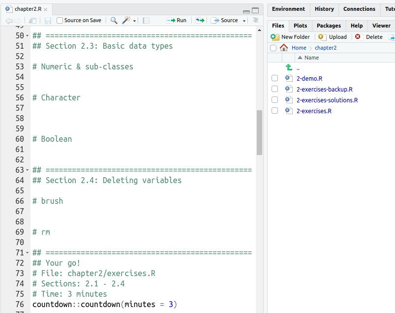

```{r setup, include = FALSE}
options(htmltools.dir.version = FALSE)
library(knitr)
library(fontawesome)
library(xaringanExtra)
# set default options
opts_chunk$set(echo = FALSE,
               collapse = TRUE,
               fig.width = 7.252,
               fig.height = 4,
               dpi = 300)
xaringanExtra::use_tile_view()
xaringanExtra::use_broadcast()
xaringanExtra::use_panelset()
xaringanExtra::use_share_again()
xaringanExtra::style_share_again(
  share_buttons = c("twitter")
)
```

class: right, top
background-image: url(https://images.unsplash.com/photo-1472289065668-ce650ac443d2?ixlib=rb-1.2.1&auto=format&fit=crop&w=1350&q=80)
background-position: 75% 75%
background-size: cover

.right-column[
# `r rmarkdown::metadata$title`

### `r rmarkdown::metadata$author`</br></br>

#### http://bit.ly/jr-auto-train
]

.left[.footnote[<span>Photo by <a href="https://unsplash.com/@joannakosinska?utm_source=unsplash&amp;utm_medium=referral&amp;utm_content=creditCopyText">Joanna Kosinska</a> on <a href="https://unsplash.com/backgrounds/colors?utm_source=unsplash&amp;utm_medium=referral&amp;utm_content=creditCopyText">Unsplash</a></span>]]

---

name: jr
## Jumping Rivers

.pull-left[

]

.pull-right[
.right[
### Stats Consultancy
### R & Python training
### Dashboard creation
]
]


---

name: many-training-courses

## Hundreds of courses a year

```{r}
knitr::include_graphics("img/r-lecture.jpg")
```

???
* We deliver over 100 R, Python and Stan training courses each year
* Engaging with thousands of new learners.

---
name: Jamie-dull
class: middle inverse

# Moving training online

--

### `r fa(name = "virus", fill = "white")` &nbsp; So March 2020 happened

--

### `r fa(name = "user-friends", fill = "white")` &nbsp; We tested online training internally

--

### `r fa(name = "tired", fill = "white")` &nbsp;  It was DULL


--

### `r fa(name = "code", fill = "white")` &nbsp; Made it more interactive

--

### `r fa(name = "layer-group", fill = "white")` &nbsp; Lots of work for trainers


???

The necessity to move to fully online training in March last year meant we quickly had to completely rethink how to deliver R training interactively online. We internally trialled running our usual in-person training just on Zoom - and it really doesn’t work trust us!

---

```{r fig.align='center', out.width="80%"}
include_graphics("img/deborah.jpg")
```

---

```{r fig.align='center', out.width="100%"}
include_graphics("img/flow-1.png")
```

---
class: middle
```{r fig.align='center', out.width="80%"}
include_graphics("img/asana-zoom.png")
```

---

```{r fig.align='center', out.width="100%"}
include_graphics("img/flow-2.png")
```

---
class: middle
```{r, eval = FALSE, echo = TRUE}
jrDroplet::create_droplet_from_asana("https://app.asana.com/...")
ℹ Creating a Droplet from Asana task
...
✓ Droplet configuration finished
```

---

```{r fig.align='center', out.width="100%"}
include_graphics("img/flow-3b.png")
```

---
```{r fig.align='center', out.width="100%"}
include_graphics("img/flow-4.png")
```

---


```{r fig.align='center', out.width="100%"}
include_graphics("img/notes.png")
```

---

```{r fig.align='center', out.width="100%"}


```

---

```{r fig.align='center', out.width="100%"}
include_graphics("img/flow-5.png")
```

---

```{r fig.align='center', out.width="80%"}
include_graphics("img/welcome.png")
```

---

```{r fig.align='center', out.width="100%"}
include_graphics("img/flow-6.png")
```

---
class: middle 
```{r fig.align='center', out.width="100%"}
include_graphics("img/virtual-training-env.png")
```

---
```{r fig.align='center', out.width="100%"}
include_graphics("img/flow-7.png")
```


---
class: middle 
```{r fig.align='center', out.width="80%"}
include_graphics("img/slack-notify.png")
```

---

# Google Docs

.panelset[
.panel[.panel-name[What]

#### Quick Quiz!

Visit: [bit.ly/user2021-quiz](https://bit.ly/user2021-quiz)

]

.panel[.panel-name[Why]

- Good for formative assessment
- Freedom to ask questions 
- Available after the course

]

.panel[.panel-name[How]

```{r, echo = TRUE}
q = "Where was the first useR! conference?"
choices = c("Dortmund, Germany", "Rennes, France", "Vienna, Austria", "I'm not sure")

jrNotes2::make_ballot(q, choices)
```

]

.panel[.panel-name[Code]

```{r, echo = TRUE}
render_docx = function(){
  rmarkdown::render("index.Rmd", output_format = "word_document",
                    params = list(asana = course_info, extdata = extdata))
}
```

```{r, echo = TRUE}
upload_docx = function(){
  upload = googledrive::drive_upload("index.docx", path = client_dir)
  googledrive::drive_share(upload, role = "writer", type = "anyone")
  message(glue::glue("Document uploaded to: {web_link}"))
}
```


]
]
---
name: jrCertificate

# jrCertificate

.panelset[
.panel[.panel-name[What]

```{r fig.align='center', out.width="80%"}
include_graphics("img/demo_jrCertificate.gif")
```

]

.panel[.panel-name[Why]

- Easy for non-tech
- Direct emails

```{r, out.width = "60%"}
magick::image_read_pdf("demos/Rhian_Davies_Getting_to_Grips_with_the_Tidyverse_certificate.pdf",
                       pages = 1)
```

]

.panel[.panel-name[How]

- {emayili} for sending emails
- {RHandsontable} for copy-paste table
- {magick} for `image_annotate()`

]
]

---
name: worth-it
# Was it worth it?

```{r, out.width = "70%", fig.cap="https://xkcd.com/1205/", fig.align='center'}
include_graphics("img/xkcd-1205.png")
```

---

name:top-tips
class: middle inverse

## Final Thoughts

### `r fa(name = "code", fill = "white")` &nbsp;  Automating is fun!

--

### `r fa(name = "chalkboard-teacher", fill = "white")` &nbsp; Focus on teaching


--

### `r fa(name = "user-friends", fill = "white")` &nbsp; It takes a team


---

class: right, middle, inverse


## Find me at...

#### [`r fa(name = "slack")` _sponsor_jumping_rivers](https://app.slack.com/client/T0270SMAND9/C026XL96ACV/thread/C027G7K56M7-1625579750.318200)  
#### [`r fa(name = "twitter")` @statsRhian / @jumping_uk](http://twitter.com/statsRhian)  
#### [`r fa(name = "link")` jumpingrivers.com](https://www.jumpingrivers.com/)  
#### [`r fa(name = "slideshare")` http://bit.ly/jr-auto-train](http://bit.ly/jr-auto-train)  

