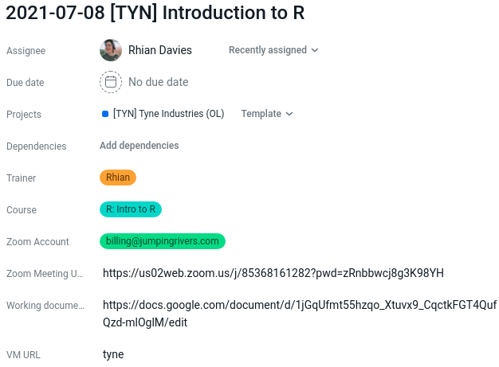
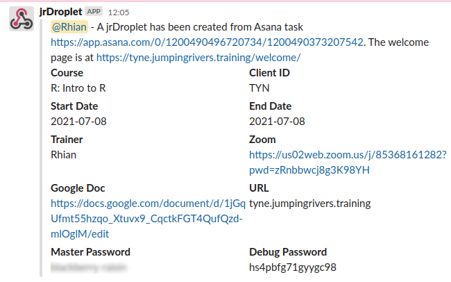

```{r setup, include = FALSE}
options(htmltools.dir.version = FALSE)
library(knitr)
library(fontawesome)
library(xaringanExtra)
# set default options
opts_chunk$set(echo = FALSE,
               collapse = TRUE,
               fig.width = 7.252,
               fig.height = 4,
               dpi = 300)
xaringanExtra::use_tile_view()
xaringanExtra::use_broadcast()
xaringanExtra::use_panelset()
xaringanExtra::use_share_again()
xaringanExtra::style_share_again(
  share_buttons = c("twitter")
)
```

class: right, top
background-image: url(https://images.unsplash.com/photo-1472289065668-ce650ac443d2?ixlib=rb-1.2.1&auto=format&fit=crop&w=1350&q=80)
background-position: 75% 75%
background-size: cover

.right-column[
# `r rmarkdown::metadata$title`

### `r rmarkdown::metadata$author`</br></br>

#### http://bit.ly/jr-auto-train
]

.left[.footnote[<span>Photo by <a href="https://unsplash.com/@joannakosinska?utm_source=unsplash&amp;utm_medium=referral&amp;utm_content=creditCopyText">Joanna Kosinska</a> on <a href="https://unsplash.com/backgrounds/colors?utm_source=unsplash&amp;utm_medium=referral&amp;utm_content=creditCopyText">Unsplash</a></span>]]

---

name: jr
## Jumping Rivers

.pull-left[

]

.pull-right[
.right[
### Stats Consultancy
### R & Python training
### Dashboard creation
]
]


---

name: many-training-courses

## Hundreds of courses a year

```{r}
knitr::include_graphics("img/r-lecture.jpg")
```

???
* We deliver over 100 R, Python and Stan training courses each year
* Engaging with thousands of new learners.

---
name: Jamie-dull
class: middle inverse

## Moving training online

--

### `r fa(name = "virus", fill = "white")` &nbsp; So March 2020 happened

--

### `r fa(name = "user-friends", fill = "white")` &nbsp; We tested online training internally

--

### `r fa(name = "tired", fill = "white")` &nbsp;  It was DULL

???

The necessity to move to fully online training in March last year meant we quickly had to completely rethink how to deliver R training interactively online. We internally trialled running our usual in-person training just on Zoom - and it really doesn’t work trust us!

---
name: r-materials

## Starting point: R Materials

.pull-left[
- Already using {rmarkdown} {tufte} notes, {xaringan} slides
- On GitLab with many CI checks
- Course packages to handle dependencies e.g. {jrIntroduction} 
]

.pull-right[
```{r}
include_graphics(path = "img/notes.png")
```
]


???

- Even our Python course are built with R infrastructure
- We just count chapters from 0 instead...

---
name: asana
# Everything in Asana

.panelset[
.panel[.panel-name[Asana]

```{r fig.align='center', out.width="50%"}

```

```{r, eval = FALSE, echo = TRUE}
jrDroplet::create_droplet_from_asana("https://app.asana.com/0/1200490496720734/1200490373207542")
```

]

.panel[.panel-name[Welcome Page]

```{r fig.align='center', out.width="60%"}

```

]

.panel[.panel-name[Training Environment]

```{r fig.align='center', out.width="100%"}
include_graphics("img/virtual-training-env.png")
```

]

.panel[.panel-name[Post-Course]
.pull-left[
```{r fig.align='center', out.width="100%"}
include_graphics("img/typeform.png")
```
]

.pull-right[
- Register uploaded to Asana
- Personalised certificates
- Markdown feedback reports via Typeform
]
]
]

???

- Asana
  - One localised place

- Welcome Page
  - One URL - all materials
  - Set up account
  - Links to Zoom & Google Doc
  - {shiny} app with websockets

- Virtual Training Environment
    - Materials uploaded
    - Relevant R packages installed
    - All tagged with version (reproducible)
---

# jrDroplet

.panelset[
.panel[.panel-name[What]

```{r fig.align='center', out.width="70%"}

```


]


.panel[.panel-name[Why]

- System & R dependencies managed
- Training materials pre-populated

]

.panel[.panel-name[How]

- {analogsea} to talk to Digital Ocean
- Grab artefacts from GitLab
- Asana & Slack APIs

]

.panel[.panel-name[Code]

```{r, echo = TRUE}
#Snippet to give the main ideas
```

]
]


---

# Google Docs

.panelset[
.panel[.panel-name[What]

#### Quick Quiz!

Visit: [bit.ly/user2021-quiz](https://bit.ly/user2021-quiz)

]

.panel[.panel-name[Why]

- Good for formative assessment
- Freedom to ask questions 
- Available after the course

]

.panel[.panel-name[How]

```{r, echo = TRUE}
q = "Where was the first useR! conference?"
choices = c("Dortmund, Germany", "Rennes, France", "Vienna, Austria", "I'm not sure")

jrNotes2::make_ballot(q, choices)
```

]

.panel[.panel-name[Code]

```{r, echo = TRUE}
render_docx = function(){
  rmarkdown::render("index.Rmd", output_format = "word_document",
                    params = list(asana = course_info, extdata = extdata))
}
```

```{r, echo = TRUE}
upload_docx = function (public = TRUE){
  filename = construct_gdoc_filename(course_info)
  upload = googledrive::drive_upload("index.docx", name = filename,
                                     overwrite = TRUE, type = "document", path = client_dir)
  if (isTRUE(public)) {
    googledrive::drive_share(upload, role = "writer", type = "anyone")
  }
  message(glue::glue("\n\nDocument uploaded to: {web_link}"))
}
```


]
]
---
name: jrCertificate

# jrCertificate

.panelset[
.panel[.panel-name[What]

```{r fig.align='center', out.width="80%"}
include_graphics("img/demo_jrCertificate.gif")
```

]

.panel[.panel-name[Why]

- Easy for non-tech
- Direct emails

```{r, out.width = "60%"}
magick::image_read_pdf("demos/Rhian_Davies_Getting_to_Grips_with_the_Tidyverse_certificate.pdf",
                       pages = 1)
```

]

.panel[.panel-name[How]

- {emayili} for sending emails
- {RHandsontable} for copy-paste table
- {magick} for `image_annotate()`

]

.panel[.panel-name[Code]

```{r, echo = TRUE}
#Snippet to give the main ideas
```

]
]

---
name: auto-breakfast
class: center middle inverse

<video controls width="640" height="480">
<source src="img/auto-breakfast.mp4" type="video/mp4">
</video>

.left[.footnote[<span><a href="https://youtu.be/mk6zbY8i4_8?t=64">https://youtu.be/mk6zbY8i4_8</a></span>]]

---
name: worth-it
# Was it worth it?

```{r, out.width = "70%", fig.cap="https://xkcd.com/1205/", fig.align='center'}
include_graphics("img/xkcd-1205.png")
```

---
name: slack-poll

# Yes!

```{r, out.width = "80%", fig.align='center'}
include_graphics("img/poll.png")
```

---

name:top-tips
class: middle inverse

## Final Thoughts

--

### `r fa(name = "code", fill = "white")` &nbsp;  Automating is fun!

--

### `r fa(name = "chalkboard-teacher", fill = "white")` &nbsp; Focus on teaching


--

### `r fa(name = "user-friends", fill = "white")` &nbsp; It takes a team


---

class: right, middle, inverse


## Find me at...

#### [`r fa(name = "twitter")` @statsRhian](http://twitter.com/statsRhian)  
#### [`r fa(name = "twitter")` @jumping_uk](http://twitter.com/jumping_uk)  
#### [`r fa(name = "link")` jumpingrivers.com](https://www.jumpingrivers.com/)  
#### [`r fa(name = "slideshare")` http://bit.ly/jr-auto-train](http://bit.ly/jr-auto-train)  

