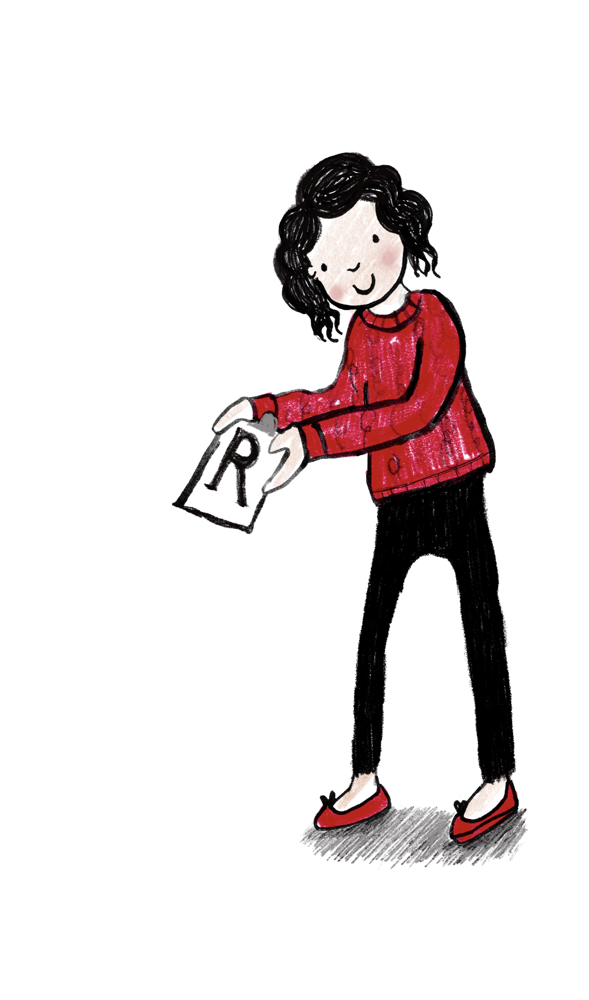

```{r setup, include = FALSE}
library(knitr)
library(fontawesome)
opts_chunk$set(echo = FALSE,
               collapse = TRUE,
               fig.width = 7.252,
               fig.height = 4,
               dpi = 300)
```

class: right, top, inverse
background-image: url(https://img.rawpixel.com/s3fs-private/rawpixel_images/website_content/rm208-251-jj-58.jpg?w=1000&dpr=1&fit=default&crop=default&q=65&vib=3&con=3&usm=15&bg=F4F4F3&ixlib=js-2.2.1&s=bc40bb61e8b3105b0498292b1947fb73)
background-position: 75% 75%
background-size: cover

.right-column[
## `r rmarkdown::metadata$title`  </br>
### `r rmarkdown::metadata$twitter`
]

.left[.footnote[Image by rawpixel.com]]

---

## Motivation

- C.V doesn't give me a feel picture

- Showcase your strengths

- Not just for new jobs - promotion, awards

---

# What is a data science portfolio

Artists have portfolios

Finished artwork
Examples of sketches or working documents that show your creative process
Examples that show a range of different skills within your area of specialization
Examples of strong observational drawing skills (whatever your medium)
A range of subject matter
Well-balanced compositions
Original art that demonstrates creativity and originality
Logically ordered examples that show progression or some sort of “journey”


>
Whether you’re applying to study a creative field at college or are looking for jobs in the art, design, or photography field, you’ll need a top-notch portfolio to showcase your work. An art portfolio isn’t a collection of everything you’ve ever made; rather, it’s a carefully curated sample of your best work and that which best reflects your style. 

Ideally, your portfolio should be individually tailored to a particular application, following any particular instructions they may have regarding length or what to include. It’s always a good idea to have a “default” or “master” portfolio to refer to, when pulling together applications.

Here are some examples of great art portfolios for inspiration, and some tips for what yours should include.


Get Your Portfolio Ready to Go
Professional Portfolio Presentation

Take the Class
What Should an Art Portfolio Include?
Art portfolios may be required for fine arts, graphic design, fashion design, architecture, photography, web design, or conceptual art-related courses or jobs. So, what you include in it will depend on your medium.

When deciding what to include in your portfolio, be sure to follow any specific instructions for the college or job you’re applying for. But generally speaking, you should include:

Finished artwork
Examples of sketches or working documents that show your creative process
Examples that show a range of different skills within your area of specialization
Examples of strong observational drawing skills (whatever your medium)
A range of subject matter
Well-balanced compositions
Original art that demonstrates creativity and originality
Logically ordered examples that show progression or some sort of “journey”
portfolio books
Source: Instagram
Examples of student art portfolios.
How to Make an Art Portfolio
Art portfolios may be digital or in physical form. While you may be more likely to need an online portfolio when applying for or bidding on jobs, if you’re applying to an art program in college, a physical portfolio is often preferred. Check your institution’s requirements. 

You may be wondering how many examples of art in portfolios is ideal. This depends on whether you have any space limitations. Don’t assume that more is always better, although it’s necessary to include enough examples to show the depth and range of your artistic practice.

In general, you should choose examples of your best work for your portfolio. Sometimes you will be asked to include sketches or workbook pages to show your working process. 

> Portfolios should tell some type of story, or show progression. This could be the “story” of how you used different types of media to depict a single subject, or your progression from a rough outline or concept to a finished piece. However you interpret this story or journey, the pieces in your portfolio should be carefully ordered in a way that shows this progression. Colleges are usually as interested in seeing potential and growth in a student as they are spotting raw talent.

Actresses have show reels

Your GitHub repo is your portfolio

What does it say about you?

---

# Disclaimer

- You don't need a massive portfolio

- One quality story is better than lots of half finished stuff

- Doesn't need daily commits


https://twitter.com/samantha_gold/status/1005087589894893569 # embed tweet

- Signpost with the GitHub special repository

---

class: inverse, middle, center

.left-col[.center[
`r fa(name = "rss", fill = "white", height = "3em")`
## Share
]]

--

.center-col[
.center[

`r fa(name = "heart", fill = "white", height = "3em")`
## your
]]

--

.right-col[.center[

`r fa(name = "comment-alt", fill = "white", height = "3em")`
## story
]]

???

Share: GitHub / Website

Your: Should be personal, something to connect over, chat in interview

Story: Rainbow, communication skills


---

## Great data story

- Ability to communicate
- Ability to collaborate with others
- Technical competence
- Ability to reason about data
- Motivation and ability to take initiative

---

---

# Potential projects ideas

- Data cleaning project
- Storytelling
- End-to-end project
- Explanatory post - what is a p-value?
- \#RStats \#TidyTuesday
- \#30DayMapChallenge
- Rtistry

---

# Tools

- R Markdown
- {hugodown} and {distill}
- Jupyter Notebooks
- 
---
class: inverse, middle, center

# What's __my__ data story?
`r fa(name = "github", fill = "white", height = "3em")`

---

class: right, middle, inverse



# Find me at...

#### [`r fa(name = "twitter")` @statsRhian](http://twitter.com/statsRhian)  
#### [`r fa(name = "github")` @statsRhian](http://github.com/statsRhian)  
#### [`r fa(name = "link")` rhian.rbind.io](https://rhian.rbind.io)  
