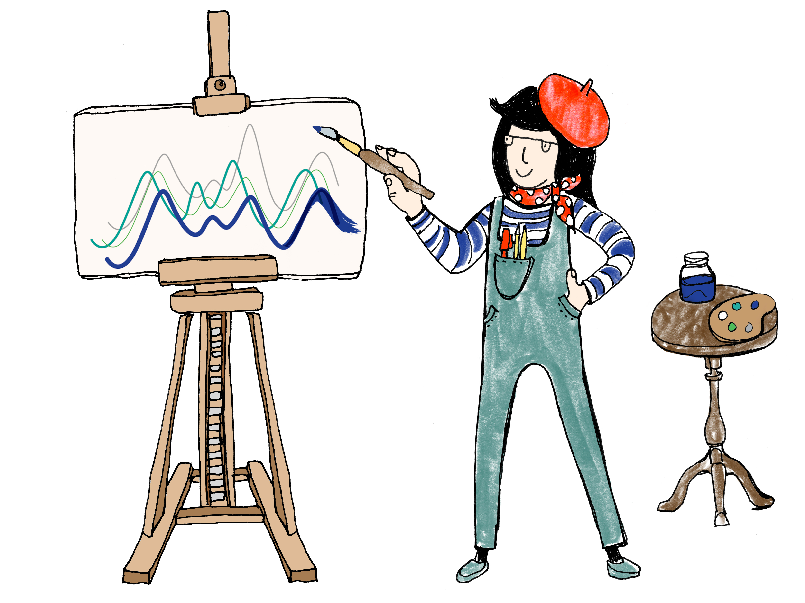
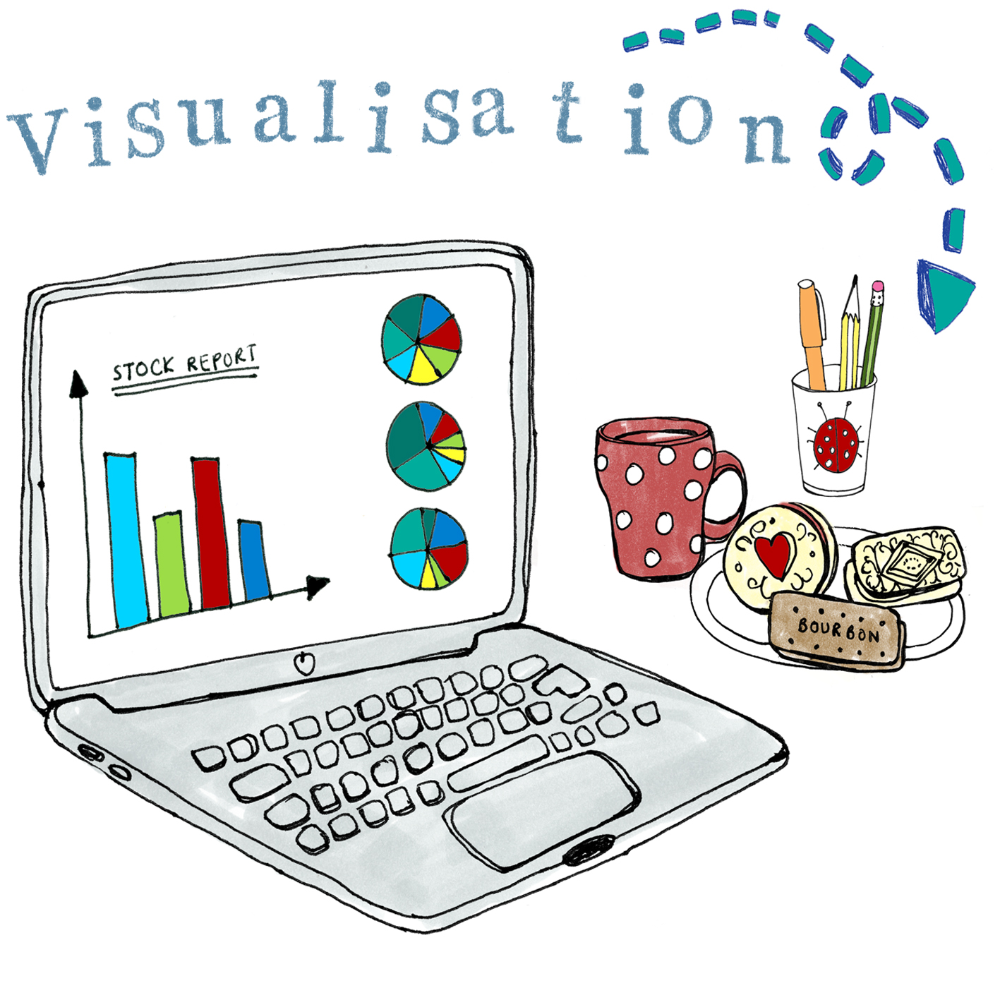
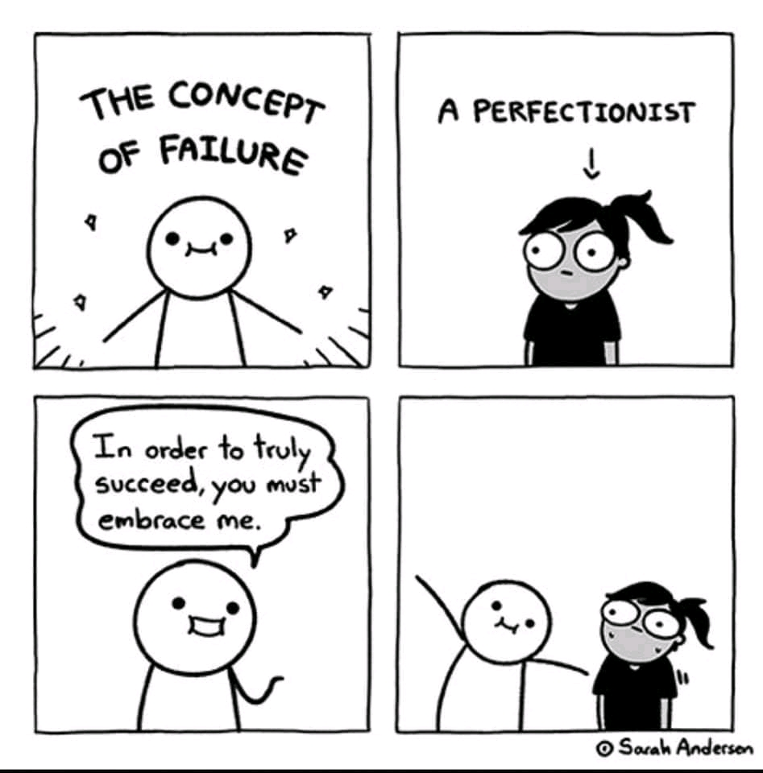
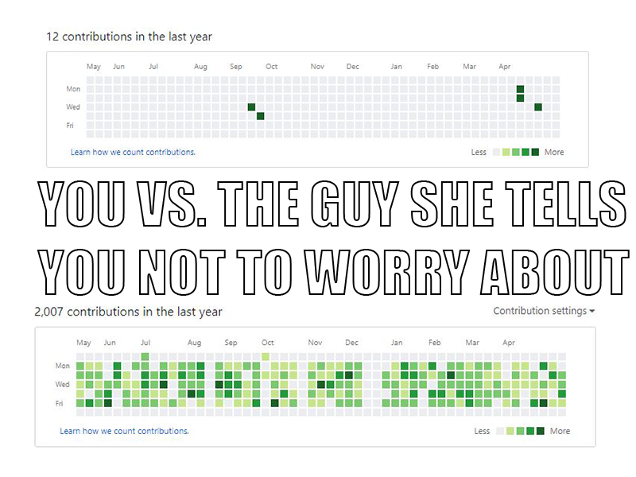
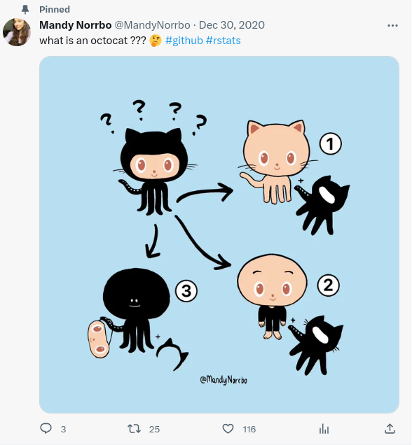
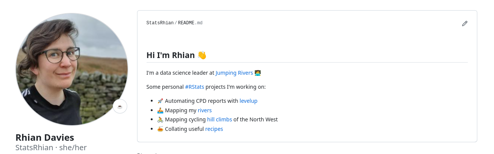

```{r setup, include = FALSE}
library(knitr)
library(fontawesome)
opts_chunk$set(echo = FALSE,
               collapse = TRUE,
               fig.width = 7.252,
               fig.height = 4,
               dpi = 300)
```

class: right, top, inverse
background-image: url(https://images.unsplash.com/photo-1472289065668-ce650ac443d2?ixlib=rb-1.2.1&auto=format&fit=crop&w=1350&q=80)
background-position: 75% 75%
background-size: cover

.right-column[
# `r rmarkdown::metadata$title`  </br>
### `r rmarkdown::metadata$author`</br>
##### `r rmarkdown::metadata$twitter`
]

.left[.footnote[<span>Photo by <a href="https://unsplash.com/@joannakosinska?utm_source=unsplash&amp;utm_medium=referral&amp;utm_content=creditCopyText">Joanna Kosinska</a> on <a href="https://unsplash.com/backgrounds/colors?utm_source=unsplash&amp;utm_medium=referral&amp;utm_content=creditCopyText">Unsplash</a></span>]]

---

## Why make a data science portfolio?

.pull-left[
- Evidence of skills

- Highlights your strengths and interests

- Makes you stand out

- Helps others get to know you
]
.pull-right[
<center></center>
]

---

## What makes a portfolio?

.pull-left[

- Variety of skills

- Show the creative process

- Personal

- Highlight your strengths

]
.pull-right[<center></center>]

---

## Your turn

- Introduce yourself to someone near you
    - work interests
    - strengths
    - hobbies
    - current portfolio
- What could enhance your portfolio?

```{r}
countdown::countdown(minutes = 5)
```
---

## Potential projects

.pull-left[
- Blog post of a statistical analysis
- Explaining a statistical concept in tweet
- Visualisation of a dataset #TidyTuesday
- Software development
- Talk on your research
- Lecture notes
]
.pull-right[
<center></center>
]

---

class: inverse, middle, center

.left-col[.center[
`r fa(name = "rss", fill = "white", height = "3em")`
## Share
]]

--

.center-col[
.center[

`r fa(name = "heart", fill = "white", height = "3em")`
## your
]]

--

.right-col[.center[

`r fa(name = "comment-alt", fill = "white", height = "3em")`
## story
]]

???

Share: GitHub / Website

Your: Should be personal, something to connect over, chat in interview

Story: Rainbow, communication skills

---

class: inverse, middle, center

# Common misconceptions

---

## It doesn't have to be perfect

<center></center>

[@sarahandersencomics](https://www.instagram.com/sarahandersencomics/)


---

## You don't need a massive portfolio

<center></center>

???
- 3 - 5 projects
- Quality finished is better

---

## It doesn't have to be code

<center></center>

---

## You don't need a website

<center></center>

---

## What I look for

- Formulate an interesting question
- Reason about data & state assumptions
- Communicate the findings
- Collaborate with others
- Technical competence
- Professional layout
- Reflection

---

## Tools to help 

- Quarto / R Markdown / Jupyter Notebooks
- Git, GitHub and GitLab
- {hugodown} and {distill}

---
class: inverse, middle, center

# What's __my__ data story?
`r fa(name = "github", fill = "white", height = "3em")`

---

# Your turn

- What data story would enhance your portfolio?
- How does it show your **strengths**?
- What makes you stand out?

```{r}
countdown::countdown(minutes = 5)
```

---

class: right, middle, inverse


#### [`r fa(name = "github")` @statsRhian](https://github.com/statsRhian)
#### [`r fa(name = "link")` rhian.rbind.io](https://rhian.rbind.io)  
